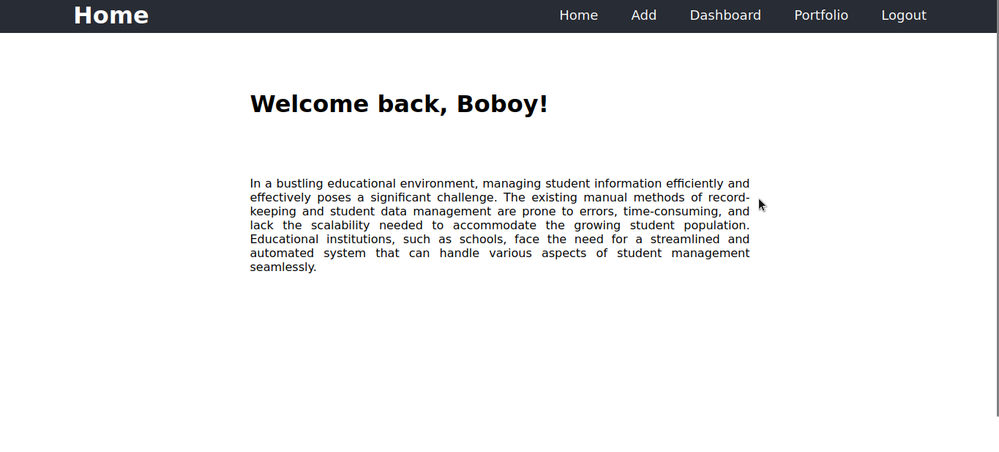

# ACLC Student Management System

> A simple Full Stack Web Application that stores the students info.

In a bustling educational environment, managing student
information efficiently and effectively poses a significant
challenge. The existing manual methods of record-keeping and
student data management are prone to errors, time-consuming,
and lack the scalability needed to accommodate the growing
student population. Educational institutions, such as
schools, face the need for a streamlined and automated
system that can handle various aspects of student management
seamlessly.



## Installation


``` sh
cd /opt/lampp/htdocs

git clone https://github.com/sphyxi4/aclc-student-management.git

# Make sure to have a XAMPP

sudo /opt/lampp/lampp start

127.0.0.1

# copy the database file into phpMySQL

localhost/aclc-student-management/app/login.php
```


## Usage example

### CRUD
- Create - add a student to database
- Read - displays the students in a table
- Delete - deletes the student info
- Update - updates the students info


## Technology Used

        

